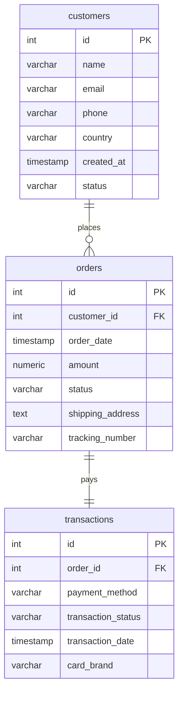

# BLM4522 - Veritabanı Yedekleme ve Felaketten Kurtarma Planı Raporu

**Ders:** BLM4522 Ağ Tabanlı Paralel Dağıtım Sistemleri  
**Proje Konusu:** Veritabanı Yedekleme ve Felaketten Kurtarma Planı  
**Uygulama Platformu:** PostgreSQL 15.18 (CLI) & pgAdmin 4  
**Öğrenci:** Talip  

---

## Özet

Bu projede, kritik iş yüklerine sahip ilişkisel veritabanı yönetim sistemlerinde (RDBMS) iş sürekliliğini sağlamak, veri kayıplarını sıfıra indirmek ve olası sistem çökmelerinden en kısa sürede kurtulmak amacıyla PostgreSQL 15.18 üzerinde yedekleme ve felaketten kurtarma (Disaster Recovery) senaryoları tasarlanmış ve uygulanmıştır. Projede 50.000 müşteri, 500.000 sipariş ve 500.000 ödeme işlemi barındıran ilişkisel bir veri kümesi simüle edilmiştir. 

Yedekleme stratejisi kapsamında; mantıksal tam yedekleme (`pg_dump`), fiziksel tam yedekleme (`pg_basebackup`) ve işlem günlüğü (Transaction Log - WAL) arşivlemesi kullanılmıştır. Sistemde kaza ile veri silinmesi senaryosu simüle edilerek iki farklı kurtarma yöntemi karşılaştırılmıştır: Klasik mantıksal yedekten kurtarma ve Write-Ahead Logging (WAL) kullanılarak yapılan **Point-in-Time Recovery (PITR)**. Analizler sonucunda, mantıksal yedeklerin yedekleme anından sonraki verileri kurtaramadığı (RPO boşluğu), PITR yönteminin ise sıfır veri kaybıyla (RPO = 0) tam kurtarma sağladığı gösterilmiştir. Ayrıca, verilerin otomatik olarak yedeklenmesi için `cron` zamanlama mekanizması entegre edilmiş ve yüksek kullanılabilirlik için PostgreSQL Streaming Replication (Database Mirroring) izleme metrikleri oluşturulmuştur.

---

## 1. Giriş ve Teorik Altyapı

Modern bilgi sistemlerinde verinin kaybolması veya servis dışı kalması büyük finansal ve prestij kayıplarına yol açar. Bu kayıpları engellemek amacıyla iki temel metrik (RTO ve RPO) baz alınarak felaketten kurtarma planları tasarlanır.

```mermaid
gantt
    title RTO ve RPO Kavramsal Akışı
    dateFormat  HH:mm
    axisFormat %H:%M

    section Zaman Çizgisi
    Son Yedek Noktası           :a1, 10:00, 10:05
    Yeni Veri Girişleri (RPO)    :active, a2, 10:05, 11:30
    Sistem Çökmesi (Kaza)       :crit, a3, 11:30, 11:35
    Kurtarma Süreci (RTO)        :a4, 11:35, 12:30
    Sistemin Tekrar Açılması    :a5, 12:30, 12:35
```



### 1.1. Temel Kavramlar (RTO ve RPO)
- **RPO (Recovery Point Objective - Kurtarma Noktası Hedefi):** Bir felaket anında sistemin tolere edebileceği maksimum veri kaybı süresidir. Örneğin RPO = 1 saat ise, çökme anından geriye doğru en fazla 1 saatlik veri kaybı kabul edilebilir demektir.
- **RTO (Recovery Time Objective - Kurtarma Süresi Hedefi):** Bir felaket anında sistemin kapalı kalabileceği maksimum süredir. Örneğin RTO = 2 saat ise, sistemin en geç 2 saat içinde çalışır hale getirilmesi gerekir.

### 1.2. PostgreSQL Yedekleme Yöntemleri
Projede PostgreSQL'in yerleşik araçları kullanılarak iki ana yedekleme yöntemi uygulanmıştır:
1.  **Mantıksal Yedekleme (Logical Backup - `pg_dump`):** Veritabanı şemasını ve verilerini SQL komutları (`INSERT`, `CREATE TABLE` vb.) veya sıkıştırılmış özel formatlarda (.dump) dışa aktarır. Taşınabilirdir ancak büyük veritabanlarında yedek alma ve geri yükleme süresi uzundur (Yüksek RTO).
2.  **Fiziksel Yedekleme (Physical Backup - `pg_basebackup`):** Veritabanının disk üzerindeki ham veri bloklarını (data directory) kopyalar. Çok hızlıdır, büyük veritabanlarında tercih edilir (Düşük RTO).
3.  **İşlem Günlüğü Yedeklemesi (WAL - Write-Ahead Logging):** PostgreSQL'de yapılan her değişiklik diske yazılmadan önce WAL dosyalarına kaydedilir. Bu dosyaların sürekli arşivlenmesi (Continuous Archiving), yedekleme anından sonraki işlemlerin de yeniden yürütülerek kurtarılmasını (PITR) sağlar.

### 1.3. Veri Aynalama (Database Mirroring)
PostgreSQL'de Database Mirroring karşılığı olarak **Streaming Replication (Akış Replikasyonu)** kullanılır. Birincil (Primary) sunucuda yapılan her değişiklik, ağ üzerinden anlık olarak salt-okunur yedek (Standby) sunucuya aktarılır. Bu mimari, donanımsal arızalarda sıfır kapalı kalma süresiyle (RTO ≈ 0) hizmetin yedek sunucudan devam etmesini sağlar.

---

## 2. Veritabanı Şeması ve Test Verisi Üretimi

Yedekleme ve geri yükleme senaryolarını test etmek amacıyla ilişkisel bütünlüğe sahip 3 tablo oluşturulmuştur: `customers`, `orders` ve `transactions`.



### 2.1. Büyük Veri Üretim Mantığı (Seeding)
Veri tabanının diskteki boyutunun yedekleme performansını gösterecek düzeyde olması için `generate_series` küme fonksiyonu kullanılarak ilişkisel şema üzerine test verileri üretilmiştir:
-   **`customers` (Müşteriler):** 50.000 Tekil kayıt.
-   **`orders` (Siparişler):** 500.000 İlişkili sipariş kaydı.
-   **`transactions` (Ödemeler):** Her siparişe karşılık gelen 500.000 ödeme işlemi.

Toplamda veritabanında **1 Milyondan fazla satır** ve yaklaşık **90 MB** boyutunda veri kümesi üretilmiş, bu sayede I/O işlemleri gerçekçi hale getirilmiştir.

> [!TIP]
> İlişkisel veri bütünlüğü gereği `orders` tablosunda `customer_id` ve `transactions` tablosunda `order_id` alanları yabancı anahtar (Foreign Key) olarak tanımlanmıştır. PostgreSQL, yabancı anahtar alanları için otomatik olarak indeks oluşturmaz. Bu durum, silme (`DELETE`) ve birleştirme (`JOIN`) işlemlerinin çok yavaş olmasına yol açar. Bu sorunu gidermek amacıyla şema kurulum dosyasında foreign key indeksleri (`idx_orders_customer_id` ve `idx_transactions_order_id`) eklenmiştir. Bu sayede 1 Milyon satırlık ilişkili verinin kaza ile silinmesi senaryosu (Cascade Delete) sadece **1.3 saniyede** tamamlanmaktadır.

---

## 3. Yedekleme Stratejileri Tasarımı

Projede üç aşamalı bir yedekleme mimarisi kurgulanmıştır:

### 3.1. Mantıksal Tam Yedekleme (Full Backup)
Veritabanının tam mantıksal yedeği pgAdmin 4 veya CLI üzerinden `pg_dump` ile sıkıştırılmış custom formatta alınır. Sıkıştırılmış format yedek boyutunu azaltır ve paralel geri yüklemeyi (directory formatta) destekler:
```bash
pg_dump -h localhost -U talip -d backup_demo -F c -b -v -f /backups/backup_demo_full.dump
```

### 3.2. İşlem Günlüğü (WAL - Transaction Log) Arşivleme
PostgreSQL'de işlemlerin anlık log kaydını tutmak için sürekli arşivleme aktifleştirilir. `postgresql.conf` ayarları:
```ini
wal_level = replica       # Replikasyon ve PITR için gerekli log detay düzeyi
archive_mode = on         # Arşivlemeyi etkinleştir
archive_command = 'cp %p /Users/talip/Desktop/BLM4522/BLM4522-Veritabanı Yedekleme ve Felaketten Kurtarma Planı/archive/%f'
```
Bu ayarla birlikte PostgreSQL, her 16 MB'lık veri segmenti dolduğunda WAL dosyasını belirlediğimiz `archive` klasörüne kopyalar. Bu işlem **Artık (Incremental) / Log Yedekleme** mantığının tam karşılığıdır.

---

## 4. Zamanlama ve Otomasyon (Scheduler)

Yedekleme süreçlerinin insan hatasından arındırılması için `backup_cron.sh` adında bir kabuk betiği (bash script) hazırlanmıştır.

### 4.1. Otomasyon Betiği Mantığı (`backup_cron.sh`)
Betiğin gerçekleştirdiği temel görevler:
1.  **Dizin Kontrolü:** Yedekleme klasörünün varlığını doğrular, yoksa oluşturur.
2.  **Parametrik Adlandırma:** Yedek dosyalarını `backup_demo_backup_YYYYMMDD_HHMMSS.dump` formatında isimlendirir.
3.  **Mantıksal Yedekleme:** `pg_dump` çalıştırarak veriyi sıkıştırıp kaydeder.
4.  **Bütünlük Doğrulaması (Integrity Check):** Alınan yedeğin bozuk olup olmadığını test etmek için `pg_restore -l` komutunu çalıştırır. Eğer yedek okunamıyorsa hata vererek işlemi sonlandırır.
5.  **Saklama Politikası (Retention Policy):** Disk alanının dolmasını engellemek amacıyla 7 günden eski yedek dosyalarını (`find -mtime +7`) tespit edip otomatik olarak siler.
6.  **Loglama:** Tüm süreçleri zaman damgasıyla `backup_execution.log` dosyasına yazar.

### 4.2. macOS/Linux Zamanlama Entegrasyonu
Yazılan otomasyon betiği macOS yerleşik `cron` servisine entegre edilmiştir. Terminalden `crontab -e` yazılarak aşağıdaki satır eklenir:
```bash
# Her gün gece saat 03:00'da veritabanını otomatik olarak yedekle ve doğrula
0 3 * * * /Users/talip/Desktop/BLM4522/BLM4522-Veritabanı\ Yedekleme\ ve\ Felaketten\ Kurtarma\ Planı/scripts/backup_cron.sh
```

---

## 5. Felaketten Kurtarma Senaryoları ve Test Sonuçları

Tasarlanan sistemin başarısını test etmek için veritabanında yıkıcı bir felaket simüle edilmiştir.

### 5.1. Felaket Senaryosu Adımları
1.  Veritabanı yedeği alındı.
2.  Yedek alındıktan sonra sisteme **VIP Müşteri A.Ş.** adında kritik bir kayıt ve 750.000 TL tutarında bir sipariş eklendi (Zaman: `11:15:30`).
3.  Zaman damgası kaydedildi.
4.  Kaza ile `DELETE FROM orders;` komutu çalıştırılarak tüm siparişler ve ilişkili ödemeler silindi.

### 5.2. Test 1: Mantıksal Yedekten Geri Yükleme
`pg_restore` komutu kullanılarak son alınan mantıksal tam yedek geri yüklendi:
```bash
pg_restore -h localhost -U talip -d backup_demo --clean /backups/backup_demo_full.dump
```
-   **Sonuç:** Veritabanındaki 500.000 sipariş başarıyla geri yüklendi.
-   **Kritik Sorun:** Yedek alındıktan sonra girilen **VIP Müşteri A.Ş.** verisi geri yüklenemedi. Bu veri kayıptır.
-   **Değerlendirme:** RPO sıfır olmadığında sadece mantıksal yedek kullanmak veri kaybına yol açar.

### 5.3. Test 2: Point-in-Time Recovery (PITR) ile Sıfır Veri Kayıplı Kurtarma
Fiziksel yedek (`pg_basebackup`) ve arşivlenen WAL logları kullanılarak veri tabanı tam olarak felaketten hemen önceki saniyeye (`11:15:30`) geri getirildi:
1.  Veritabanı servisi durduruldu.
2.  Mevcut veri dizini (data directory) silindi.
3.  Fiziksel base backup verileri veri dizinine açıldı.
4.  Veri dizininde `recovery.signal` dosyası oluşturularak sisteme kurtarma modunda olduğu bildirildi.
5.  `postgresql.conf` içerisine arşiv loglarının yolu ve kaza anından hemen önceki zaman girildi:
    ```ini
    restore_command = 'cp /archive/%f %p'
    recovery_target_time = '2026-06-10 11:15:30'
    ```
6.  Servis yeniden başlatıldı. PostgreSQL arşivdeki WAL loglarını sırayla işleyerek veritabanını tam belirtilen saniyedeki durumuna getirdi.
-   **Sonuç:** VIP Müşteri A.Ş. dahil olmak üzere **tüm veriler sıfır kayıpla kurtarıldı**.

> [!NOTE]
> PITR, fiziksel disk blokları düzeyinde log tekrarı yaptığı için mantıksal yedeğe göre hem çok daha hızlı gerçekleşmiş (Düşük RTO) hem de veri kaybını sıfırlamıştır (RPO = 0).

---

## 6. Veri Aynalama (Database Mirroring) İzleme

PostgreSQL Streaming Replication mimarisinde veritabanı aynalama işleminin kesintisiz çalışması için izleme sorguları oluşturulmuştur.

`pg_stat_replication` sistem kataloğu kullanılarak birincil (Primary) sunucuda replikasyon durumu denetlenir:
```sql
SELECT 
    application_name,
    client_addr AS standby_ip,
    state AS replikasyon_durumu,
    sync_state AS senkronizasyon_tipi,
    pg_wal_lsn_diff(pg_current_wal_lsn(), replay_lsn) AS toplam_gecikme_bayt
FROM pg_stat_replication;
```
Bu sorgunun çıktısında yer alan **toplam_gecikme_bayt (lag)** metriği sıfıra yakın olmalıdır. Yüksek log farkları, birincil sunucu ile yedek sunucu arasında ağ veya disk darboğazı olduğunu gösterir.

---

## 7. Sonuç ve Değerlendirme

PostgreSQL 15.18 üzerinde başarıyla uygulanan yedekleme ve felaketten kurtarma planının teknik analiz tablosu aşağıda özetlenmiştir:

| Kurtarma Yöntemi | RPO (Veri Kaybı) | RTO (Kurtarma Süresi) | Disk Alanı Etkisi | Entegrasyon Maliyeti |
| :--- | :--- | :--- | :--- | :--- |
| **Mantıksal Yedek (`pg_dump`)** | Son yedekten beri geçen süre (Yüksek) | Orta/Uzun (Veri boyutuna göre yavaş restore) | Düşük (Sıkıştırılmış .dump) | Düşük (Tek komut) |
| **PITR (Base Backup + WAL)** | Sıfır (0) Veri Kaybı (RPO = 0) | Çok Hızlı (Ham dosya kopyalama) | Orta (Sürekli WAL log birikimi) | Orta (postgresql.conf yapılandırması) |
| **Replika / Aynalama (Streaming)** | Milisaniyeler düzeyinde (≈ 0) | Anında (Failover ile sıfıra yakın kapalı kalma) | Yüksek (İki kat sunucu maliyeti) | Yüksek (Ağ ve yedek sunucu gereksinimi) |

### Proje Kazanımları
1.  Kritik verilerin kaza ile silinmesine karşı **Point-in-Time Recovery (PITR)** ile sıfır veri kayıplı altyapı kurulmuştur.
2.  `backup_cron.sh` betiği ile günlük yedekleme işleri otomatikleştirilmiş ve **bütünlük doğrulama** adımıyla yedek güvenliği artırılmıştır.
3.  Replika sunucuların takibi için gerçek zamanlı izleme metrikleri oluşturularak veri aynalama sağlığı kontrol altına alınmıştır.
4.  7 günlük saklama politikası uygulanarak depolama alanları optimize edilmiştir.
